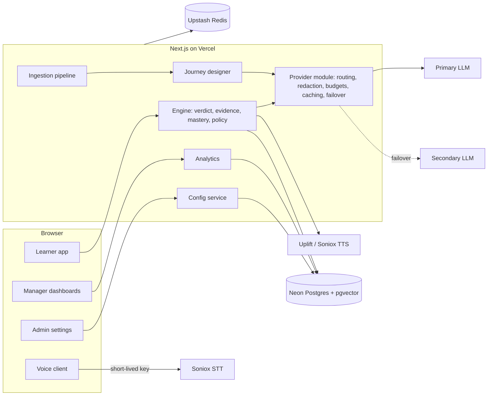

# Mashq AI

**Turn any training document into an adaptive, bilingual, voice-enabled learning journey.**

Mashq (مشق, Urdu for "practice") takes a PDF, Word file, slide deck, web page or pasted text and designs a short, story-driven learning journey from it. Learners then work through that journey as a conversation with an AI tutor, by text, taps or voice, in English, Urdu (Arabic script), Roman Urdu, or the natural Urdu/English mix people actually speak.

Instead of quizzing, Mashq estimates mastery from what the learner does: explanations, choices, applications, mistakes, self-corrections, hint use and delayed recall. It adapts difficulty, depth, pace, practice mechanic and language in real time, and it shows exactly why it made every decision.

The core rule: **the LLM generates, rules decide, everything is logged.**

---

## Contents

- [Features](#features)
- [How it works](#how-it-works)
- [Tech stack](#tech-stack)
- [Getting started](#getting-started)
- [Environment variables](#environment-variables)
- [Scripts](#scripts)
- [Testing and evaluation](#testing-and-evaluation)
- [Deployment](#deployment)
- [Project structure](#project-structure)
- [Configuration and presets](#configuration-and-presets)
- [Security and privacy](#security-and-privacy)
- [Contributing](#contributing)

---

## Features

### Content to curriculum

- **Many input types.** PDF, DOCX, PPTX (slide order and speaker notes kept), plain text, pasted text and public URLs. Large files are parsed in a browser worker; uploads are size-capped, magic-byte checked and ZIP-bomb guarded.
- **Grounded journey design.** A design-tier model builds an outline (chapters, concepts, prerequisites), then mission packs with questions, answer keys, hints, worked examples and role-play scenarios.
- **Verifiable facts.** Every fact carries a verbatim quote from the source, checked in code before a model checks entailment. The tutor cites fact ids, and learners can open "show source" to see the highlighted passage.
- **Resumable ingestion.** Parsing, normalisation, PII redaction, injection scanning, chunking and design run as resumable stages that stream progress over SSE and fit inside serverless time limits.

### Adaptive tutor

- **Deterministic engine.** Verdicts, evidence events, BKT-style mastery (with soft evidence and uncertainty ranges), engagement state (frustration, fatigue, pace), difficulty and the adaptation policy are pure functions in `src/server/engine`. The model never awards XP, changes mastery, picks the next move or unlocks content.
- **Ordered rule table.** Sixteen rules (limits, frustration, stuck, partial answers, deepen, retention callbacks, fatigue, language drift, mechanic variety and more) choose from a closed catalogue of tutor moves. Each decision is stored with a human-readable reason.
- **Practice mechanics.** Scenarios, role-play, puzzles, decisions, teach-back and a final challenge, weighted per persona and learned per learner.
- **Streaming turns.** One model call for a typical turn, a custom line protocol that streams display text, speech text, verdicts and citations separately, and cached prompt prefixes that survive live persona and language switches.
- **Engine Inspector.** A live side panel (bottom sheet on mobile) showing evidence, mastery bars with ranges, rule firings with reasons, and turn latency, so anyone can see why the tutor did what it did.

### Voice and language

- **Four language modes:** English, Urdu, Roman Urdu and mixed, with correct `lang`/`dir` per message, `<bdi>` isolation for Latin terms and Nastaliq-safe line heights.
- **Speech in:** Soniox real-time STT from the browser, using short-lived keys minted by the server.
- **Speech out:** Uplift and Soniox TTS behind a server proxy with per-language routing, time-to-first-byte failover, sentence-level prefetch and barge-in.
- **Graceful degradation:** provider failover, then browser speech, then captions and text, driven by capability detection of the device and network.

### Gamification (without dark patterns)

- Deterministic XP, levels, streaks with a weekly freeze, badges, chapter unlocks and story beats.
- No leaderboards by default, no timers, no streak shaming, one celebration per mission, and reduced motion respected everywhere.

### Dashboards, reports and administration

- **Learners** see their own progress, estimated mastery (always labelled as an estimate) and the next best thing to do.
- **L&D managers** get a filterable dashboard (date, content, cohort, persona, language, modality) with a mastery heatmap, funnel and content health, CSV export of every widget, and a printable A4 "Content Effectiveness and Learner Progress" report.
- **Admins** change settings without a rebuild. Every change is versioned, validated, diffable, audited and reversible, and running sessions pick it up within seconds. A system view shows provider health, failovers, cache hit rates, latency and cost.

---

## How it works



**A single tutor turn:**

1. Load session state and the effective config version.
2. Get a verdict: deterministic for keyed answers (choices, puzzles), a fast-tier model grade for free text.
3. Write an evidence event and replay mastery for the concept from the evidence log.
4. Update engagement state and run the rule table to pick the next move, with a reason sentence.
5. Ask the fast-tier model to _render_ that move, grounded in the mission's facts, streaming display and speech lines.
6. Guard the output: citations must reference known facts, numbers must appear in the source, and a sampled audit checks for unsupported claims.
7. Award XP, stream speech to the voice client, and log tokens, cost, latency and cache use.

Every LLM and embedding call goes through one provider module (`src/server/llm/provider.ts`) that handles routing by task tier, PII redaction, token and spend budgets, prompt-cache breakpoints, retries, a circuit breaker and secondary-provider failover. Model ids live in config, never in call sites.

---

## Tech stack

| Area          | Choice                                                                          |
| ------------- | ------------------------------------------------------------------------------- |
| Framework     | Next.js 16 (App Router, Node runtime), React 19, TypeScript (strict)            |
| Styling       | Tailwind CSS 4                                                                  |
| Database      | Neon Postgres with pgvector (`halfvec`) and full-text search, via Drizzle ORM   |
| Auth          | Better Auth with database sessions and roles (`admin`, `ld_manager`, `learner`) |
| LLMs          | Anthropic (design and fast tiers), Google Gemini (fallback and embeddings)      |
| Speech        | Soniox (real-time STT and TTS), Uplift AI (TTS), browser speech as last resort  |
| Rate limiting | Upstash Redis                                                                   |
| Parsing       | unpdf, mammoth, fflate, linkedom, Mozilla Readability                           |
| Validation    | Zod at every boundary (routes, env, config, LLM output, JSONB columns)          |
| Logging       | pino JSON logs with request ids, Axiom integration                              |
| Testing       | Vitest, Playwright with axe-core, custom eval suites                            |
| Hosting       | Vercel (functions, crons, Blob)                                                 |

---

## Getting started

### Prerequisites

- Node.js 22 (see `.nvmrc`) and pnpm 11
- A Neon database (or any Postgres with the `vector` extension available)
- API keys for Anthropic, Google AI, Soniox and Uplift AI
- An Upstash Redis database

### Setup

```bash
git clone https://github.com/NabiBukhsh-AI/MASHQ-AI.git
cd MASHQ-AI
pnpm install

cp .env.example .env.local   # then fill in the values
pnpm env:check               # validates every variable

pnpm db:migrate              # creates the schema (and the vector extension)
pnpm db:views                # creates the analytics views
pnpm db:seed                 # organisation, roles, badges and demo accounts
pnpm db:seed --demo          # optional: demo journeys and learner activity for the dashboards

pnpm dev                     # http://localhost:3100
```

Sign in with one of the demo accounts you configured in `.env.local`. Admins land on `/admin`, L&D managers on `/manage`, and learners on `/learn`.

Seeding never calls a model: demo journeys are loaded from committed fixtures in `eval/fixtures/seed/journeys`.

---

## Environment variables

All variables are validated at startup by `src/env.ts`. See `.env.example` for the full list.

| Variable                                                                    | Purpose                                 |
| --------------------------------------------------------------------------- | --------------------------------------- |
| `DATABASE_URL`                                                              | Postgres connection string              |
| `BETTER_AUTH_SECRET`, `BETTER_AUTH_URL`                                     | Session signing and the public base URL |
| `NEXT_PUBLIC_APP_URL`                                                       | Public app URL                          |
| `ANTHROPIC_API_KEY`                                                         | Primary LLM provider                    |
| `GOOGLE_GENERATIVE_AI_API_KEY`                                              | Fallback LLM and embeddings             |
| `SONIOX_API_KEY`, `UPLIFT_API_KEY`                                          | Speech-to-text and text-to-speech       |
| `UPSTASH_REDIS_REST_URL`, `UPSTASH_REDIS_REST_TOKEN`                        | Rate limiting                           |
| `HEALTH_TOKEN`, `PSEUDONYM_SECRET`, `SPEECH_SIGNING_SECRET`, `CANARY_TOKEN` | Server secrets, 32+ random bytes each   |
| `CRON_SECRET`                                                               | Authorises Vercel cron requests         |
| `DEMO_*_EMAIL`, `DEMO_*_PASSWORD`                                           | Accounts created by `pnpm db:seed`      |

Provider keys are server-only. The browser only ever receives short-lived Soniox keys from `/api/voice/*-key`.

---

## Scripts

| Command                 | Description                                                     |
| ----------------------- | --------------------------------------------------------------- |
| `pnpm dev`              | Development server on port 3100                                 |
| `pnpm build` / `start`  | Production build and server                                     |
| `pnpm typecheck`        | TypeScript type checking                                        |
| `pnpm lint`             | ESLint                                                          |
| `pnpm lint:dashes`      | Rejects em dashes in tracked text files                         |
| `pnpm test`             | Unit tests (Vitest)                                             |
| `pnpm e2e`              | End-to-end tests (Playwright)                                   |
| `pnpm env:check`        | Validates environment variables                                 |
| `pnpm db:generate`      | Generates a Drizzle migration from schema changes               |
| `pnpm db:migrate`       | Applies migrations                                              |
| `pnpm db:views`         | Recreates the analytics views                                   |
| `pnpm db:views:check`   | Lists and times each analytics view                             |
| `pnpm db:seed [--demo]` | Seeds reference data, accounts and optional demo activity       |
| `pnpm db:config-sync`   | Re-applies chosen code defaults as a new audited config version |
| `pnpm db:studio`        | Drizzle Studio                                                  |
| `pnpm eval:grounding`   | Grounding suite: quote verification and grounding pass rates    |
| `pnpm eval:injection`   | Prompt-injection red-team suite                                 |
| `pnpm eval:turn-audit`  | Audits live tutor turns for unsupported claims                  |
| `pnpm pipeline:live`    | Runs the ingestion and design pipeline against real providers   |
| `pnpm turn:live`        | Plays tutor turns against real providers                        |
| `pnpm tts:live`         | Synthesises one signed sentence through the real TTS router     |
| `pnpm latency:live`     | Measures turn latency against a deployment                      |
| `pnpm analytics:live`   | Times every dashboard query on seeded data                      |
| `pnpm fixtures:export`  | Exports generated journeys as seed fixtures                     |
| `pnpm warmup --url <u>` | Warms a deployment's functions and caches                       |
| `pnpm smoke --url <u>`  | Read-only production smoke check                                |

Scripts ending in `:live` call real providers and cost money. They read `.env.local`.

---

## Testing and evaluation

- **Unit tests** (`*.test.ts` next to the code) cover the engine math, rule table, stream parser, parsers, redaction, config validation, security headers and more. The engine's mastery, evidence and policy code is verified against a worked example to three decimals.
- **End-to-end tests** (`e2e/`) cover authentication, ingestion, the learner journey, live controls, voice fallbacks with a fake microphone, the Engine Inspector, dashboards, the printable report, admin settings, privacy actions and security headers, with axe accessibility checks.
- **Eval suites** (`eval/suites`) measure grounding quality, prompt-injection resistance (with a red-team case set in `eval/fixtures/redteam`) and unsupported-claim rate on real tutor turns.

Git hooks (via `simple-git-hooks`) run the dash lint and lint-staged on commit, check the commit message, and run typecheck and unit tests before push.

---

## Deployment

The app is built for Vercel:

- `vercel.json` sets the region, a 300 s function limit, and two daily crons: `/api/cron/embed` and `/api/cron/retention`.
- Long work (ingestion and design) runs as resumable stages with a 240 s guard.
- Uploads through the server are capped at 4 MB; larger files are parsed in the browser.
- `/api/ping` is a dependency-free uptime endpoint; `/api/health?deep=1` (token protected) checks the database and pgvector.

**CI** (`.github/workflows/ci.yml`) runs typecheck, lint, the dash lint, unit tests and a dependency audit on every push and pull request.

**Smoke** (`.github/workflows/smoke.yml`) runs a read-only production check daily. Set the repository variable `EVAL_BASE_URL` to your deployment URL to enable it; without it the job is skipped.

---

## Project structure

```text
src/
  app/               Next.js routes
    (auth)/          sign in
    (learner)/       journeys, sessions, progress, privacy
    (manage)/        content library, dashboard, printable report
    (admin)/         settings, audit trail, system health, demo data
    api/             route handlers (content, sessions, voice, analytics, admin, cron)
  client/            React components, session hooks, voice client, i18n
  lib/               isomorphic parsers, shared Zod schemas, text utilities
  server/
    analytics/       dashboard queries, filters, learner progress
    auth/            Better Auth setup, guards, permissions
    config/          config schema, defaults, presets, resolution, versioning
    db/              Drizzle schema, client, seed data and demo seed
    design/          outline, facts, glossary, missions, grounding checks
    engine/          turn pipeline, verdicts, evidence, mastery, policy, XP
    http/            route handler wrapper (auth, validation, rate limits, errors)
    ingest/          intake, URL fetch, normalisation, chunking, pipeline
    llm/             provider module, prompts, caching, budgets, breaker
    obs/             logging and tracing
    retrieval/       hybrid retrieval and query rewrite
    security/        CSP, redaction, canaries, CSV safety, retention
    voice/           TTS providers and routing
drizzle/             SQL migrations and analytics views
e2e/                 Playwright tests
eval/                eval suites and fixtures (seed journeys, intake files, red-team cases)
scripts/             seed, migration helpers, live checks, git hooks
```

---

## Configuration and presets

Every threshold the engine uses is a config key, never a literal. Config resolves in layers (code defaults, organisation, session, learner choices; later wins), is validated with Zod plus cross-field rules, and is stored as numbered versions with an audit trail and one-click rollback.

Presets apply live to a running session and are audited:

| Preset                 | What it does                                                             |
| ---------------------- | ------------------------------------------------------------------------ |
| Branch new joiner      | Novice persona, easier start, early hints, scenarios and role-play first |
| Senior manager         | Expert persona, formal register, decisions and teach-back first          |
| Urdu-first             | Urdu language with voice output on                                       |
| Roman Urdu             | Roman Urdu language and speech handling                                  |
| Audio off              | Text and taps only; captions and transcript stay                         |
| 5-minute micro-session | One mission, two questions, a hard time box                              |
| Low bandwidth          | No audio by default, slower polling, no animation                        |
| Screen reader          | Audio off, keyboard alternatives, verbose labels, reduced motion         |

---

## Security and privacy

- **Authorisation in every route.** `withHandler({ roles })` plus organisation and user scoping on every query; the proxy is never treated as an auth boundary.
- **PII redaction** (CNIC, phone numbers, emails, IBANs, card numbers) before any provider call, embedding or log line.
- **Prompt-injection defences:** ingest-time heuristics in English, Urdu and Roman Urdu, quarantine of flagged chunks, canary tokens, and a closed move catalogue so the model cannot drive the UI.
- **SSRF-safe URL import** that validates scheme, credentials, port and resolved address on every redirect hop.
- **Upload guards:** type and magic-byte checks, size caps, ZIP-bomb protection, encrypted-PDF rejection.
- **Web controls:** strict nonce-based CSP, security headers, origin checks, rate limits and a daily spend cap.
- **Data lifecycle:** raw audio is never stored, transcripts are redacted and truncated, analytics are pseudonymous, retention is enforced by a daily cron, and learners can export or delete their own data.
- **No raw HTML rendering:** model and content text goes through safe Markdown and bidi-aware components.

---

## Contributing

- Commit subjects follow [Conventional Commits](https://www.conventionalcommits.org/): `feat:`, `fix:`, `perf:`, `refactor:`, `docs:`, `test:`, `build:`, `ci:`, `chore:`.
- Use commas, colons or parentheses instead of em dashes; `pnpm lint:dashes` enforces it.
- Validate with Zod at every boundary, and read settings only through `src/server/config/service.ts`.
- Route every LLM call through `src/server/llm/provider.ts` and refer to models by task tier, not id.
- UI copy is sentence case and active voice; errors say what happened and what to do next.
- Run `pnpm typecheck && pnpm lint && pnpm test` before opening a pull request.

---

## License

Copyright © NabiBukhsh-AI. All rights reserved.
